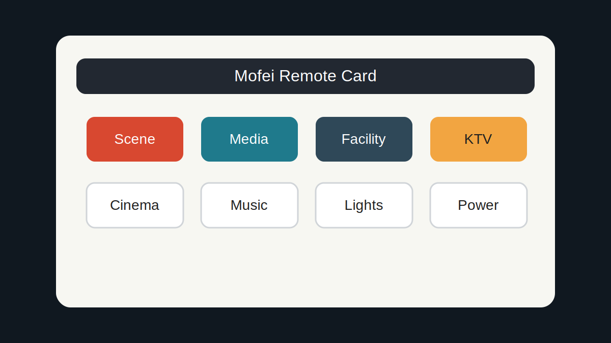

# Mofei Remote Card



Mofei Remote Card is a Lovelace custom card for Home Assistant. It provides a touch-friendly remote control interface for Mofei scenes, media devices, facility controls, lighting channels, and KTV commands.

## Features

- Built-in page switching without requiring an extra `input_select`.
- Long-press scene buttons to rename scenes.
- Dedicated pages for scene control, media control, facility control, and KTV.
- Designed to work directly with the `mofei_mqtt_bridge.send_message` service.

## Installation

### HACS

1. Open HACS.
2. Add this repository as a custom repository.
3. Select `Dashboard` as the category.
4. Install `Mofei Remote Card`.
5. Refresh the browser cache.

### Manual

Copy `mofei-remote-card.js` into `www/community/mofei-remote-card/`, then add it as a Lovelace resource:

```yaml
url: /local/community/mofei-remote-card/mofei-remote-card.js
type: module
```

## Usage

Add the card to a dashboard using YAML:

```yaml
type: custom:mofei-remote-card
title: 智能中控
service: mofei_mqtt_bridge.send_message
mac: "001122334455"
```

## Repository Name

For HACS plugin validation, the GitHub repository should be named:

```text
mofei-remote-card
```

The JavaScript file is named `mofei-remote-card.js`, which matches that repository name.

## Recommended Integration

This card is designed to work with [Mofei MQTT Bridge](https://github.com/zyjsmile857/mofei_mqtt_bridge).
